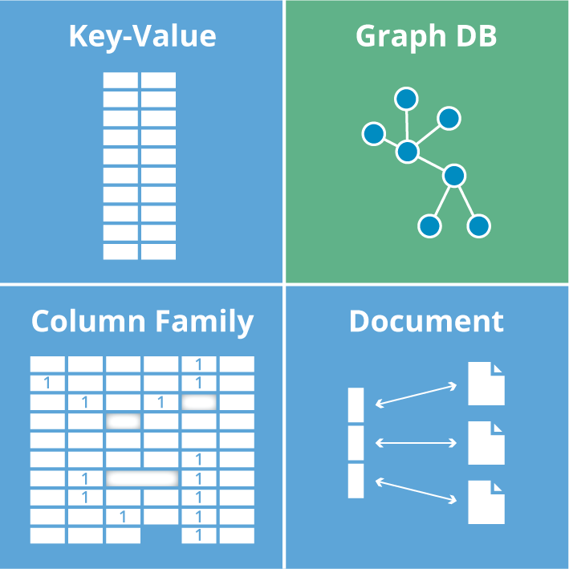
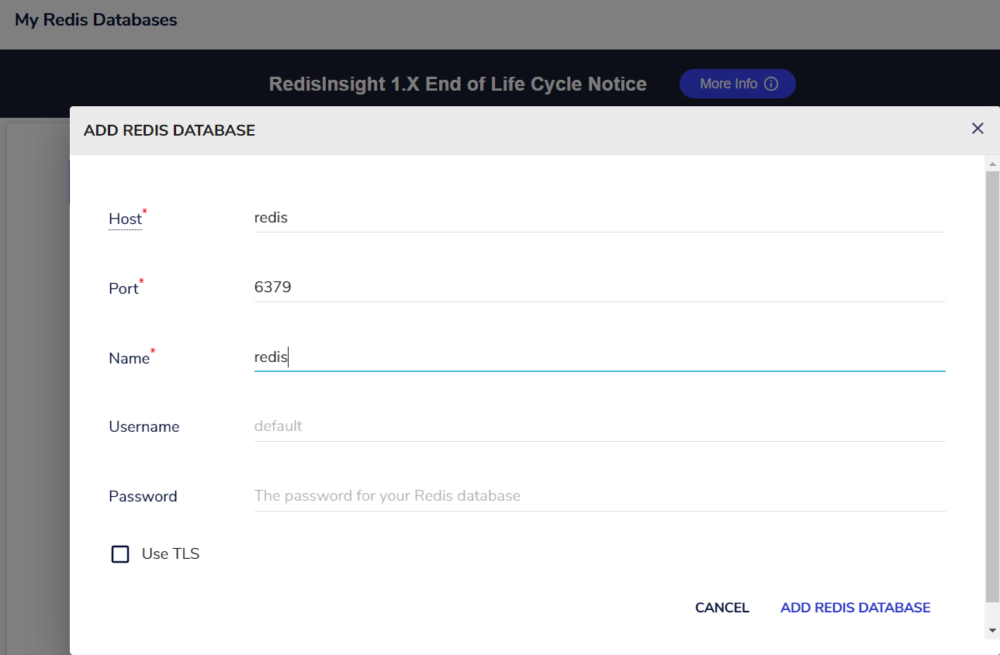
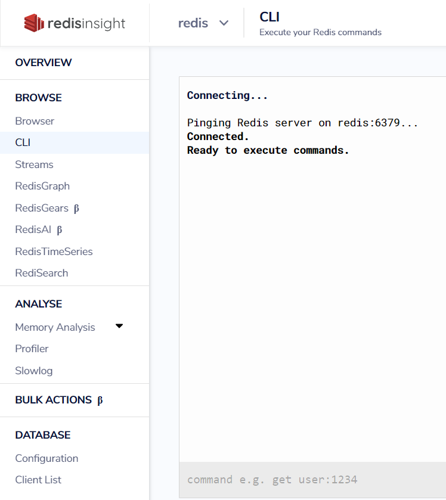
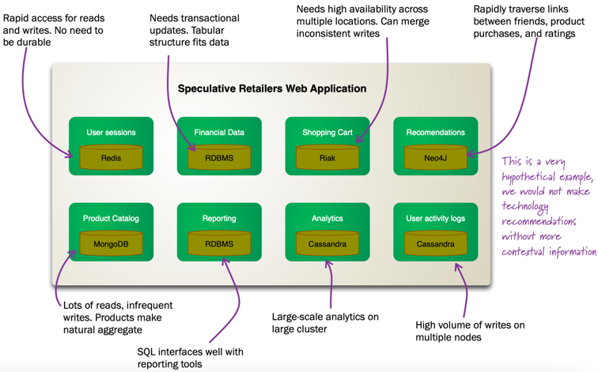

# Redis-introduction

## Requisites
- docker & docker-compose
- java 11

## Content
- Introduction to NoSQL & Redis
- Basics commands
- Connecting from kotlin and testing
- Replication & performance
- When use Redis

## NoSQL y Redis
https://www.martinfowler.com/articles/nosql-intro-original.pdf

https://www.youtube.com/watch?v=qI_g07C_Q5I

There is no standard definition of what NoSQL means. The term began with a workshop
organized in 2009, but there is much argument about what databases can truly be
called NoSQL.

But while there is no formal definition, there are some common characteristics 
of NoSQL databases

- They don’t use the relational data model, and thus don’t use the SQL language
- They tend to be designed to run on a cluster
- They tend to be Open Source
- They don’t have a fixed schema, allowing you to store any data in any record

Four common groups of NoSQL databases are: 



### Redis

Is an open source, modern, in-memory data store used as a database, cache, message broker, etc

What does this mean?
- It keeps the data in RAM memory for fast access, but also allows persistence on permanent storage
- It supports many data structures such as string, hash, set, streams, bitmaps and more
- It provides High Availability (replication) and horizontal scalability with hash-based sharding

## Let's try it!

Let's get our own redis working and add a small web interface to connect to it, just run:
`docker-compose up -d`

Now let's connect to [http://localhost:8881](http://localhost:8881) and set up the connection to our redis like:



then we just select that database and we move towards the command line interface


In case of issues with docker, we can also use [try.redis.io](https://try.redis.io/)

### Basics
 
To store data we use the command `SET <key> <value>` and to obtain a stored value we use
`GET <key>`
To know if a key exists we just ask using the command `EXISTS <key>`, this will return 1 if it exists
To Delete a ket-value pair we use `DEL <key>`.

    1 - Store your name, age and address using SET
    2 - Obtains their value using GET
    3 - Check if those keys exists
    4 - Set your address to sytacs office
    5 - Delete your address
    
Redis has supports many data structures, now we are working with the most simple one
which is storing a string as a value

Look for commands in https://redis.io/commands  or use the reddis commander interface and:

    6 - Add 2 years to your age
    7 - ADD your surname to the name
    8 - Set a TTL of 1.000 seconds to your age
    9 - Get the TTL of your age
    10 - Increment your age again and check how is TTL afected.
    11 - SET your age back to its original value, how is TTL afected?
    12 - Check the type of data for the name and age keys
    13 - Delete the TTL of your age


### RTAS
    
    6 - INCRBY age 2
    7 - APPEND name " perez"
    8 - EXPIRE age 1000
    9 - TTL age
    10 - INCRBY age 2 -> TTL age -> the TTL was not afected
    11 - SET age 29 -> TTL age -> the TTL is gone
    12 - TYPE age -> TTL name --> both are STRING
    13 - PERSIST age

**The TTL is applied to the KEY** and not to the value, and since some operations affect
only the value, the TTL remains there, meanwhile if we replace the whole K-V the TLL 
is also lost

## Data types

### String
Simplest data type. By default, Supports up to 512mb of value. Usually use for counter,
storing simple data or serialized objects:
```
SET ticket:27 "\"{'username': 'lucas', 'ticket_id': 321}\""
```

## Creation and deletion of data structures
When using LIST, SET, SORTED SET and HASH redis will automatically generate the data structures 
needed for the operations we will do, as user/programmer we don't have to create beforehand any structure
or declare a type, neither we have to delete the structures when they become empty.

Also, all comands which are read-only or delete that run agains an empty key, will work as if the data 
structure of that kind was empty

### List
Redis list id a Linked List (is not an array) of string, this means that working with the 
first/last elements is highly efficient but manipulating elements within the list 
is less performant

    L1 - Create a list with 3 programming languages you know
    L2 - Show all elements of the list
    L3 - Delete java from the list (whether or not its present)
    L4 - Add SQL after Kotlin on the list.
    L5 - Get the list size
    L6 - Get the element on the position 1
    L7 - Use the list as a queue and take the last element out
    L8 - Cut the first and last elements of the list


### RTAS

    L1 - RPUSH lista "java" "kotlin" python
    L2 - LRANGE lista 0 -1
    L3 - LREM lista 0 "java"
    L4 - LINSERT lista AFTER "kotlin" "SQL" 
      L4 bis - if "kotlin" was not on the list SQL wasnt added and the command returned -1
    L5 - LLEN lista
    L6 - LINDEX lista 1
    L7 - LPOP lista
    L8 - LTRIM lista 1 1

Redis list also support blocking operations, for this case we have two specific commands which are:

- BLOP => Blocking LPOP operation, receives one or more list from which to read and a timeout (zero for infinite)
- BLMOVE => Blocking LMOVE operation, moves from the first list to the second, 
also receives whether to read from LEFT|RIGHT and where to place it in the second list


### Hash
A redis Hash is a key-value structure. It has no predefined maximum size, allows to perform specific operations 
to elements inside of it and are encoded in a special way to make them memory efficient.

It is important to understand that Redis structures cannot be embedded in one another, so to say, it is impossible 
to have a list inside a hash.

    H0 - Create a HASH with the name "team" containing the team name and the amount of members
    H1 - Show all key-values in the hash
    H2 - Increase the amount of members of the team
    H3 - Get ONLY the amount of members of the team
    H4 - Get the size of the hash
    H5 - Get the size of the teams name
      H5 -> this wont work on try.redis.io
    H6 - Save on the HASH a list of the nicknames of the members
    H7 - Put an expiration date to the hash of 1000 seconds
    H8 - Modify the team name
    H9 - Obtain the TTL, was it afected by the update?


### RTAS

    H0 - HSET equipo nombre dubai integrantes 12
    H1 - HGETALL equipo
    H2 - HINCRBY equipo integrantes 2
    H3 - HGET equipo integrantes
    H4 - HLEN equipo
    H5 - HSTRLEN equipo nombre
    H6 - HSET equipo nombres "mufa,fran,mati S, mati M"
    H7 - EXPIRE equipo 1000
        H7 bis - TTL equipo
    H8 - HSET equipo nombre MIAME
    H9 - TTL equipo


### Sets
Redis sets are an unordered collection of string, they work as HashSet providing excelent performance
for adding, removing and retrieven elements(with a O(1) Big-O analysis).

    S1 - Create a set of UEFA teams ids with 10, 25, 40, 23 y 33
    S2 - Create a set of Ligue1 ids with 33, 55, 23, 60 y 4
    S3 - Check wheter 10 is in the UEFA set
    S4 - Get all UEFA ids
    S5 - Get all ids that are UEFA and Ligue1  
    S6 - Get all UEFA that are not in Ligue1
    S7 - Store in a new set the IDS present in any of both sets
    S8 - Remove and element from the last set


### RTAS

    L1 - SADD UEFA 10 25 40 23 33
    L2 - SADD Ligue1 33 55 23 60 4
    L3 - SISMEMBERS UEFA 10
    L4 - SISMEMBERS UEFA
    L5 - SINTER UEFA Ligue1
    L6 - SDIFF UEFA Ligue1
    L7 - SUNIONSTORE IPU UEFA Ligue1
        L7 bis - SMEMBERS IPU (must be 8)
    L8 - SREM IPU 33 or SPOP IPU

### Sorted Sets
Redis sorted sets are also a collection of string, but now the strings are associated with a score. 
The score will be used to order the string, many strings can have the same value, but strings cannot be repeated.
If two strings have the same score, they are ordered lexicographically.

    Z1 - Create a sorted set with at least 3 pets with scores from 0 to 100
    Z2 - Show all the pets
    Z3 - Show all pets with their score
    Z4 - Show pets with a score bigger than 50
    Z5 - Increase the score of a pet
    Z6 - Delete pets with a score lower than 50


### RTAS

    Z1 - ZADD mascotas 100 perro 70 hamster 50 gato 0 loro
    Z2 - ZRANGE mascotas 0 -1
    Z3 - ZRANGE mascotas 0 -1 WITHSCORES
    Z4 - ZRANGEBYSCORE mascotas 50 100
    Z5 - ZINCRBY mascotas 10 hamster
    Z6 - ZREMRANGEBYSCORE mascotas 0 49
   
- Sets and Sorted sets cannot be mixed
- Sorted set also have blocking reading operations

----

## Connection from kotlin/Java

There are lots of client to connect to Redis. All of them can be found in https://redis.io/resources/clients/.

For our example we will use Lettuce because it's an advanced client for thread-safe sync, async, and reactive usage.

Try running `konnection.kt`

Once that work we can focus on doing some TDD with Redis! but before this try running `PruebaTest.kt` to check that test run smoothly

if it's all well we can practice with:
- RedisUserIDGeneratorTest
- RedisUserRepositoryTest

----

### More about Redis

#### Persistence

Even thought Redis is an in-memory database, it offer the capabilities to persist the containing information.
This is offered through 3 mechanisms:
- *AOF (Append Only File)* : Redis will persist every change in the data in a log-like file allowing the current state to
be replicated by issuing the commands on the file. Commands are logged using the same format as the Redis protocol itself.
Redis automatically cares for reducing the log file when it gets to big in a secure way.
File sync policy can be adjusted, by default is every second. (could even be with every write)

- *RDB (Redis Database)*: Redis performs point-in-time snapshots of the dataset at specified intervals. 
This is a complete copy of all the information, this backups are smaller tha AOF but there the risk of data loss between snapshots.
RDB restarts are faster than AOF since they replicate the state and no the steps to reach it.

- RDB + AOF: Both persistence mechanism can be used in the same instance

----

#### Security

Redis security philosophy is rather interesting. Redis is designed to be accessed by trusted 
clients inside trusted environments, therefore all communication with it should be through a backend service
responsible for validating user input and ACLS.

With the default configuration Redis starts in a __protected mode__  in which it only 
replies to connection from the loopback interfaces, but no password is still required.

Redis provides two ways to authenticate clients:
- ACL (Access Control Lists): is the recommended authentication method allowing named users to be created and assigned 
fine-grained permissions.
- The legacy authentication method: is enabled by editing the redis.conf file, and providing a database password using the requirepass setting. This password is then used by all clients.
When the requirepass setting is enabled, Redis will refuse any query by unauthenticated clients. A client can authenticate itself by sending the AUTH command followed by the password.
Carefully because all redis commands travel unencrypted

It is possible to ___disallow commands___ in Redis or to rename them as an unguessable name, 
so that normal clients are limited to a specified set of commands.
```
rename-command CONFIG b840fc02d524045429941cc15f59e41cb7be6c52
```

#### Replication

Redis support leader-follower (master-slave) replication, in this case replicas will be exact copies of 
master, will reconnect to it if the link fails and will try to be an exact copy __regardless__ of what happens to the master.

How it works:

    1 - Master keeps replica updated with a stream of commands created from: user input, key expiration or other changes in the masters data
    2 - When link breaks, the replica will reconect and try to carry on from the point it left on the stream
    3 - If that's not posible, master will send a snapshot and the carry on with the stream

Replication facts:
- By default is asynchronous 
- A master can have many replicas, and replicas can have also replicas.
- Replicas can still reply to read-only queries
- Replicas can be configured to allow writes, but beware of inconsistencies!

Fortunately Redis is so easy to replicate that we already have that working on our docker-compose!
Lets take a look at that, lets connect to the replicas to check that they contain the same information as the master!


Replications works!

but in this example replicas are not promoted to master, why?

because we need 'someone' to make that decision, we have two options:

- Redis Sentinel
  - Is a distributed system for: monitoring master and replicas, notify the admin of issues, 
  make automatic failover and acts as service discovery and configuration provider
  - Comes packed with redis, but it's a separate service that needs to be started and configurated
  - It should as a minimum have 3 sentinel instances to be able to reach quorum in case of failover
- Redis Cluster
  - Is a deployment topology that allows Horizontal scaling, automatic sharding and failover
  - Its uses **Hash slot** sharding mechanism to facilitate increasing/reducing nodes.
    - There are 16384 hash slots in Redis Cluster, we simply take the CRC16 of the key then modulo 16384 and map it 
    to the corresponding node. All hashes slots are distributed equally among all nodes. If node count change 
    hash slots are redistributed.
 
### Performance & tips

#### Blocking operations

By default, Redis runs on a single thread and utilizes an event-driven non-blocking model 
which allows it to achieve high performance.

At the same time this makes redis commands ATOMIC, which means that the operation works as a whole and cannot be interrupted, 
and while this is an interesting gain, it also provides some fallbacks.

Some commands have to be used with extreme care not to block operations on the database, 
for example the command KEYS returns all keys matching a pattern, potentially blocking and impacting performance, 
instead the command SCAN should be used which allows pagination.

#### keys-value size

Key-Value size presents an important role in redis, its a good idea to reduce their size to decrease memory usage.
Redis gives us some tools to check this out, for examples lets store this information:

```
set user:unitedstate:id:123151231 "{\"name\":\"John Doe\",\"age\":30,\"email\":\"johndoe@example.com\",\"address\":{\"street\":\"123 Main Street\",\"city\":\"New York\",\"state\":\"NY\",\"country\":\"USA\"}}"

set u:us:id:123151231 "{\"n\":\"John Doe\",\"a\":30,\"e\":\"johndoe@example.com\",\"d\":{\"s\":\"123 Main Street\",\"c\":\"New York\",\"t\":\"NY\",\"y\":\"USA\"}}"
```

Using the commands MEMORY USAGE we can calculate how much we are saving in just key-names

#### Use hashes when posible

Another tip is to use hashes to store small agregates, this is because of a special encoding 
done by Redis that can use up to 10 times the less memory.

So how do we do this?

Lets say we have some users which store json data:
```
SET user:id:123456  {some json}
SET user:id:123457  {some json}
SET user:id:144444  {some json}
```
Instead of storing each user in a single key, we can store many users in a single hash structure
to do this we just make a split by the key, lets say we want to store 100 users together, we take
the id 123456 and divide it by 100, this give us 123,456 this we use in this way:

```
HSET users:id:123 456  {some json}
HSET users:id:123 457  {some json}
HSET users:id:144 444  {some json}
```


### When use Redis

As a NoSQL In-memory Key-value data store, redis excels in performance speed and low memory usage.
So when should we use it?

To answer this I use Martin Fowlers **Poliglot Persistance** 



