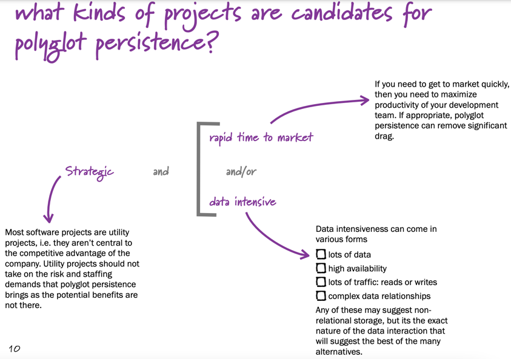

# Redis-introduccion

## Preparacion
- Tener instalado docker (y docker-compose)
- Tener idea y java 11 instalado

## Contenido
- Introduccion a NoSQL y Redis
- Comandos basicos
- Conexion desde Kotlin

## NoSQL y Redis
https://www.martinfowler.com/articles/nosql-intro-original.pdf

https://www.youtube.com/watch?v=qI_g07C_Q5I

There is no standard definition of what NoSQL
means. The term began with a workshop
organized in 2009, but there is much
argument about what databases can truly be
called NoSQL.

But while there is no formal definition, there
are some common characteristics of NoSQL
databases

- They don’t use the relational data model, and thus don’t use the SQL language
- They tend to be designed to run on a cluster
- They tend to be Open Source
- They don’t have a fixed schema, allowing you to store any data in any record

### Poliglot Persistance
Basicamente lo que tratamos es de usar aquella base de datos que nos resulte mas 
optima para resolver un problema especifico

### Redis
Redis es una DB key-value en memoria RAM, por lo que guarda para una determinada clave un valor.
Lo que separa a Redis de otras BD key-value es:
- Persiste la informacion en disco
- Permite utilizar varios tipos de estructuras para almacenar valores.

## Comandos y uso

Primero levantamos el Redis y Redis Commander desde docker con:
`docker-compose up -d`

En caso de problemas con docler-redis o algo similar se puede usar una terminal online (https://try.redis.io/) pero algunos comandos pueden no funcionar.

### Basicos
Para guardar datos usamos el comando `SET <clave> <valor>` y para obtenerlo usamos 
`GET <clave>` y esto nos devuelve el `<valor>`.
Para saber si una clave existe en la BD usamos el comando `EXISTS <clave>` y nos devolvera 1 si existe.
Para eliminar una clave usamos `DEL <clave>`.

    1 - Ingrese su nombre, edad y direccion en la BD usando el comando SET
    2 - Obtenga el valor usando GET
    3 - Consulte la existencia de esas claves
    4 - Pise su personall direccion con la direccion de la unlu (Ruta 5, Lujan)
    5 - Elimine la clave direccion
    

Redis distingue distintos tipos de datos y permite ejecutar distintas operaciones en cada uno, 
Para numeros permite incrementar/decrementar el valor, para string agregar mas texto y hasta setear timeToLive.

Buscando los comandos en https://redis.io/commands 

    6 - Agrega 2 años a tu edad
    7 - Agrega tu apellido a la clave nombre
    8 - Agregar un TTL de MIL segundos a la clave edad
    9 - Consulta el TTL de la clave edad
    10 - Incrementa devuelta la edad, consulta el TTL, como lo afecto?
    11 - Setea tu edad verdadera, consulta el TTL, como lo afecto?
    12 - Consulte el tipo de las clave nombre y edad
    13 - Elimina el TTl de la clave edad asi no es borrada automaticamente.

### RTAS
    
    6 - INCRBY clave 2
    7 - append nombre " perez"
    8 - expire edad 1000
    9 - ttl edad
    10 - incrby edad 2 -> ttl edad -> El TTL no fue afectado, sigue bajando
    11 - set edad 29 -> ttl edad -> El TTL fue afectado, ya no existe.
    12 - type edad -> type nombre --> ambas son STRING
    13 - persist edad

**El TTL se aplica POR CLAVE** y no por el valor de la misma, como ciertas operacion afectan solamente al valor el TTL no se ve afectado, pero si reemplazamos el par k,v entero si se elimina.

## Tipos de datos

### String
Tipo de dato mas simple, permite guardar un string de modo binary safe (osea tamb podes guardar un jpg por ejemplo). Se banca hasta 512mb de clave.

### List
Representa una Linked List (no un arreglo posicional sino con punteros), esto implica una rapida velocidad de escritura a principio/fin pero buscar el subindice N implica recorrer N elementos.

    L1 - Cree una lista con 3 lenguajes de programacion que conoce (se vale html -polemico-)
    L2 - Muestre TODOS los elementos de la lista
    L3 - Elimine java de la lista
    L4 - Agrege SQL (polemico) a lista despues del lenguaje "kotlin". Si no tenia ese lenguaje q sucedio?
    L5 - Obtenga el tamaño de la lista
    L6 - Obtenga el elemento de la lista en la posicion 1
    L7 - Usa la lista como una pila/cola recuperando el primer elemento de la lista y a su vez sacandolo de la misma (en un solo comando)
    L8 - Recorte la lista quedandose con los valores de entremedio

### RTAS

    L1 - rpush lista "java" "kotlin" python
    L2 - lrange lista 0 -1
    L3 - lrem lista 0 "java"
    L4 - linsert lista AFTER "kotlin" "SQL" 
      L4 bis - Si "kotlin" no estaba en la lista SQL no se agrego y el comando devolvio -1
    L5 - llen lista
    L6 - lindex lista 1
    L7 - lpop lista
    L8 - ltrim lista 1 1

## Creacion y borrado automatico de claves
Es responsabilidad de Redis borrar claves cuando las estructuras (listas, sets, hash, etc) quedan vacios.
Tamb es responsabilidad de redis crear la clave la lista por ejemplo cuando se quiere agregar un dato a la misma.
En resumen:
- Si la estructura no existe la crea y despues agrega el dato.
- Cuando la estructura se vacia Redis elimina la clave
- Ejecutar comandos read-only o comandos de eliminar elementos **siempre** devuelve null en claves vacias

### Hash
Representa un mapa guardado en una key, osea, dentro del valor de una key tenemos varios key-values.
Podemos hacer operaciones a nivel del mapa entero o ciertos key-values del mismo

    H0 - Cree un mapa en la clave "equipo" y que contenga como nombre el nombre del equipo y la cantidad de integrantes
    H1 - Muestre todos los pares clave-valor del hash
    H2 - Incremente en 2 la cantidad de integrantes del equipo
    H3 - Obtenga SOLAMENTE la cantidad de integrantes del hash
    H4 - Obtenga el tamaño del hash
    H5 - Obtenga la longuitud del nombre del equipo
      H5 - OJO que no funciona en try.redis.io
    H6 - Guarde en el mapa una lista con los nombres de los integrantes (aunq sea 3, vale apodos)
    H7 - Ponga una fecha de expiracion al hash de 1000 segundos
    H8 - modifique el nombre del equipo a MIAME
    H9 - obtenga el valor del TTL, como fue afectado?

### RTAS

    H0 - hset equipo nombre dubai integrantes 12
    H1 - hgetall equipo
    H2 - hincrby equipo integrantes 2
    H3 - hget equipo integrantes
    H4 - hlen equipo
    H5 - hstrlen equipo nombre
    H6 - hset equipo nombres "mufa,fran,mati S, mati M"
    H7 - expire equipo 1000
        H7 bis - ttl equipo
    H8 - hset equipo nombre MIAME
    H9 - ttl equipo

### Sets
Los Sets son una coleccion desordenada de strings, como tal permite la interseccion, union, resta entre otras operaciones de colecciones.

    S1 - Agrege a la coleccion buyers los nros 10, 25, 40, 23 y 33
    S2 - Agrege a la coleccion credits los nros 33, 55, 23, 60 y 4
    S3 - Consulte si 10 pertenece a los ids de buyers
    S4 - Obtenga todos los elementos de buyers
    S5 - Obtenga los ids que son buyers y credits
    S6 - Obtenga todos los buyers que no son credits
    S7 - Guarde los ids que estan en buyers o credits en la clave IPU
    S8 - Saque un elemento del conjunto IPU

### RTAS

    L1 - sadd buyers 10 25 40 23 33
    L2 - sadd credits 33 55 23 60 4
    L3 - sismember buyers 10
    L4 - smembers buyers
    L5 - sinter buyers credits
    L6 - sdiff buyers credits
    L7 - sunionstore IPU buyers credits
        L7 bis - smembers IPU (deben ser 8)
    L8 - srem IPU (clave que este en el set) o spop IPU

### Sorted Sets
Son un subtipo de Set donde los valores estan asociado con valor flotante llamado puntaje.
A diferencia del set, el Sorted Set ordena los string basandose en el puntaje, para puntajes equivalentes ordena los string alfabeticamente.
Al igual que en el set, no puede haber 2 strings iguales.

    Z1 - Arme un sorted set en la clave mascotas y que contenga nombres de animales que tendria como mascotas, el puntaje que les dara es de que tan probable lo tendria como mascota.
        EJ: zadd mascotas 100 perro 70 hamster 50 gato 0 loro 
    Z2 - Muestre todas las mascotas cargadas
    Z3 - Muestre todas las mascotas y su puntaje
    Z4 - Muestre las mascotas que tengan un puntaje mayor a 50
    Z5 - Elimine las mascotas con puntaje menor a 50

### RTAS

    Z1 - zadd mascotas 100 perro 70 hamster 50 gato 0 loro
    Z2 - zrange mascotas 0 -1
    Z3 - zrange mascotas 0 -1 WITHSCORES
    Z4 - zrangebyscore mascotas 50 100
    Z5 - zremrangebyscore mascotas 0 49
    
NO se puede hacer operaciones entre sorted sets y sets.
Se pueden hacer mas operaciones relacionadas al puntaje o posicion (ya que hay orden)
Se puede modificar puntaje y string a un elemento.

### Otros
Redis tiene mas estructuras de datos como bitmaps (maneja string de a bits), HyperLogLogs (estructura probabilisticas) y Streams (como un archivo append only).
Tambien ofrece pipelining (mandar varios comandos en un "pedido"), transacciones, arquitectura publisher-subscriber.
Replicacion y partitioning.

Partitioning significa que una base de datos esta divida entre varios nodos, permitiendo escalar en poder computacional y memoria.
Supongamos que tenemos una base divida en 4 nodos, una tecnica usada(no es la unica) es **hash partitioning** la cual implica calcular el hash a la clave y obtener valor del modulo contra la cantidad de shards y eso te indiraca a que shard mandarlo.
Ej: a _foobar_ le aplicamos hash _crc32_, devuelve _93024922_ le aplicamos _modulo 4_ (por q son 4 shards) y nos devuelve 2, indicando que esa clave se guardara en el shard 2.

## Recomendaciones

- Use hashes when possible
  - Redis compacta los hashes reduciendo tamaño, tambien se puede ahorrar idas y vueltas en busca de informacion.
  - Se puede subdividir muchas claves y guardarlas en el mismo mapa, por ejemplo todos los usuarios con id mil se guardan en un mapa user:1 donde el value para el usuario 1010 es 10 y en la clave se encuentra su valor.

## Conexion desde Kotlin

### 

### Ejercicios

### Cosas a comentar
